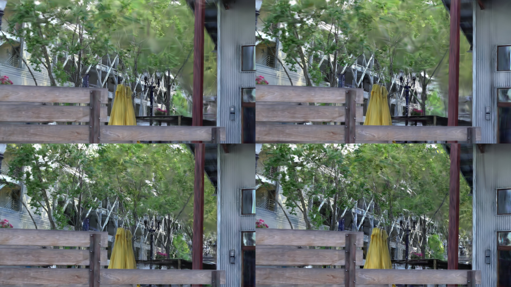
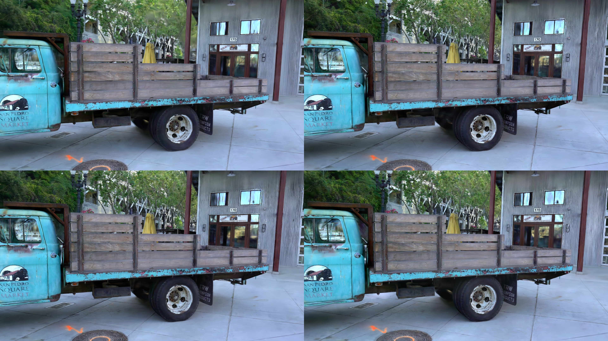
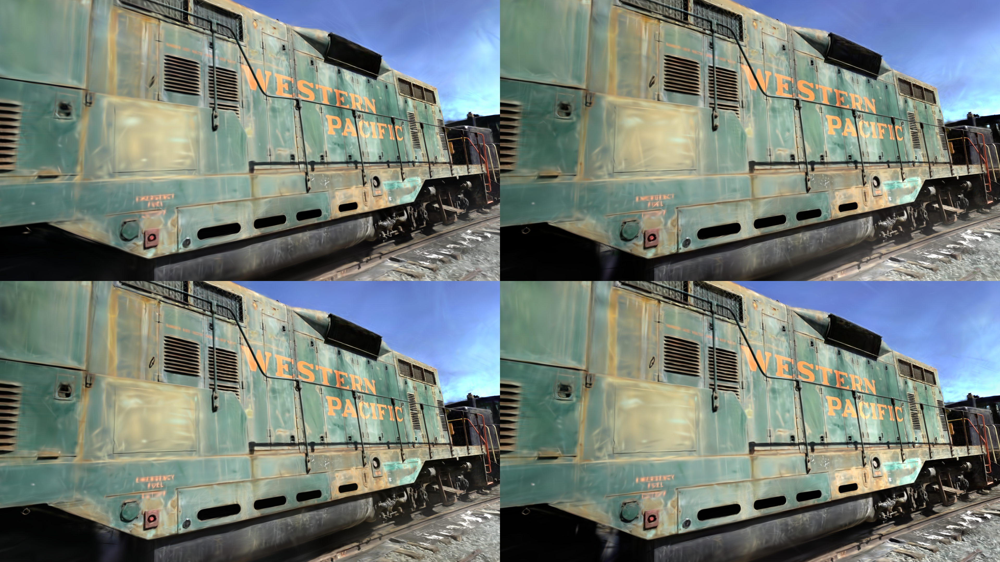

# SEGS: Saliency- and Edge-Guided Gaussian Splatting

The standard reconstruction loss has no opinion about where model capacity should go. SEGS adds edge- and saliency-aware image-space guidance to 3D Gaussian Splatting so optimization can prioritize visually important structure, and extends that signal to importance-aware densification and pruning. The repository includes controlled 3DGS, EGGS-style edge-only, saliency-only, and combined SEGS ablations together with matched-budget evaluation tooling.

> [!NOTE]
> The legacy workbooks currently committed to this repository do not record their dataset or scene. The table below is therefore an auditable optimization snapshot, not a claim about Tanks and Temples, Blender, or aggregate benchmark performance. Dataset-labeled benchmark results should replace it before the repository is cited as a benchmark release.

## Optimization snapshot

The following rows come from [`Total_Iteration_results.xlsx`](Total_Iteration_results.xlsx) and report the first recorded checkpoint near 25 dB. Higher PSNR/SSIM and lower LPIPS are better.

| Method | Iterations | PSNR | SSIM | LPIPS |
|---|---:|---:|---:|---:|
| Vanilla 3DGS | 50,000 | 25.0005 | 0.8494 | 0.2376 |
| EGGS-style edge guidance (`lambda_edge=0.6`) | 26,000 | 25.0083 | 0.8521 | 0.2353 |
| SEGS edge + saliency (`lambda_edge=0.6`, `lambda_saliency=0.4`) | **22,000** | **25.0232** | **0.8576** | **0.2260** |

In this recorded run, SEGS reached the target-quality region in 56% fewer iterations than vanilla 3DGS. Because the workbook lacks scene and hardware metadata, treat this as a reproducibility lead rather than a cross-dataset conclusion.

## Visual comparisons

| 30k-iteration comparison | Highest-PSNR output | Training comparison |
|---|---|---|
|  |  |  |

## Install, train, evaluate

```bash
git clone --recursive https://github.com/NeplayGames/gaussian-splatting.git
cd gaussian-splatting
conda env create --file environment.yml
conda activate gaussian_splatting
```

```bash
python train.py -s <dataset/scene> -m output/segs --method eggs_saliency
python render.py -m output/segs
python metrics.py -m output/segs
```

An NVIDIA GPU and a compatible CUDA toolchain are required. The upstream project documents the full hardware prerequisites, dataset preparation, viewers, and supported platform details in the [GraphDECO 3DGS README](https://github.com/graphdeco-inria/gaussian-splatting#readme).

## One-command local review

The local reviewer workflow prepares dependencies, validates the dataset, runs reduced-budget baseline and SEGS configurations, renders, evaluates, and writes `demo_output/report.html`:

```bash
python run_demo.py
```

Useful variants:

```bash
python run_demo.py --resume
python run_demo.py --full
python run_demo.py --check-only
```

Windows and Linux wrappers are also available as `run_demo.ps1` and `run_demo.sh`. The default run uses the `truck` scene, baseline and `segs_full`, seed 0, the test split, 1,000 iterations, and no viewer. It is a workflow check rather than a thesis-quality evaluation.

## Where SEGS lives

- [`LossCombiner.py`](LossCombiner.py): edge/saliency weight-map construction and weighted reconstruction loss.
- [`train.py`](train.py) and [`OriginalTraining.py`](OriginalTraining.py): method selection, curriculum, training integration, and evaluation hooks.
- [`scene/gaussian_model.py`](scene/gaussian_model.py): importance-aware densification and pruning.
- [`experiments/command_builder.py`](experiments/command_builder.py), [`tools/run_custom_methods.py`](tools/run_custom_methods.py), and [`configs/guidance_protocol.json`](configs/guidance_protocol.json): controlled ablations and experiment orchestration.
- [`docs/GUIDANCE_EVALUATION_PROTOCOL.md`](docs/GUIDANCE_EVALUATION_PROTOCOL.md) and [`docs/optimization_budget_protocol.md`](docs/optimization_budget_protocol.md): evaluation and matched-budget reporting protocols.
- [`run_demo.py`](run_demo.py), [`configs/demo_manifest.json`](configs/demo_manifest.json), and [`configs/demo_training/`](configs/demo_training/): reproducible local-review workflow.

## Evaluation protocol

Use matched dataset splits, seeds, iteration budgets, and evaluation settings when comparing `baseline`, `eggs_paper`, `eggs`, and `eggs_saliency`. Record the dataset, scene, GPU, wall-clock time, Gaussian count, model size, and render rate alongside PSNR, SSIM, and LPIPS. See [`docs/GUIDANCE_EVALUATION_PROTOCOL.md`](docs/GUIDANCE_EVALUATION_PROTOCOL.md) for the ablation matrix and [`docs/optimization_budget_protocol.md`](docs/optimization_budget_protocol.md) for quality-versus-cost reporting.

## Citation and credit

SEGS was developed as thesis research. The exact thesis title, author, institution, year, and ProQuest publication number are not present in this checkout; add those bibliographic fields here before using this repository as the CV landing page.

This work is built on Kerbl et al., *3D Gaussian Splatting for Real-Time Radiance Field Rendering*:

```bibtex
@Article{kerbl3Dgaussians,
  author  = {Bernhard Kerbl and Georgios Kopanas and Thomas Leimkuehler and George Drettakis},
  title   = {3D Gaussian Splatting for Real-Time Radiance Field Rendering},
  journal = {ACM Transactions on Graphics},
  number  = {4},
  volume  = {42},
  month   = {July},
  year    = {2023}
}
```

## License

This repository is a derivative of the GraphDECO/Inria Gaussian Splatting codebase. The original custom non-commercial research license is retained in [`LICENSE.md`](LICENSE.md), and the SEGS modifications are distributed under the same terms. See [`NOTICE`](NOTICE) for provenance and attribution. No MIT or Apache license is asserted for the derived codebase.
